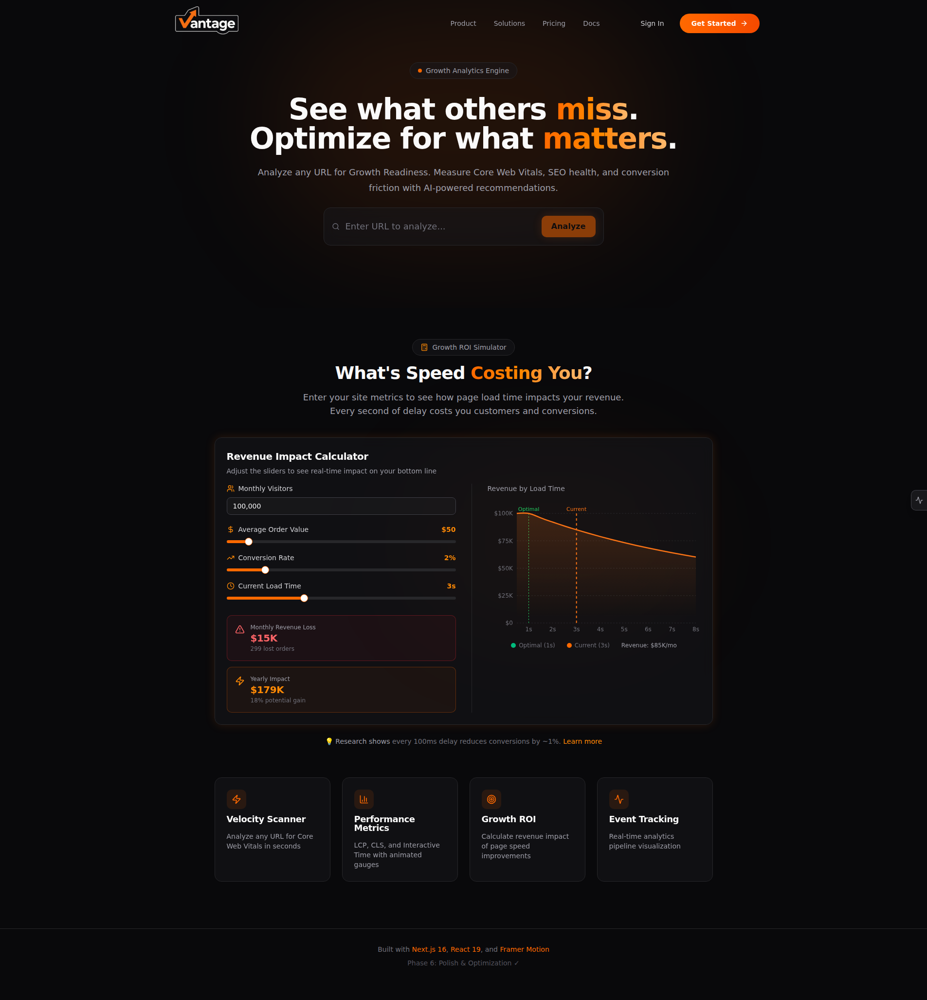

# Vantage – The Growth Analytics & Velocity Engine

> **"See what others miss. Optimize for what matters."**

Vantage is a high-performance, developer-centric dashboard designed for Growth Engineers. It analyzes any URL for "Growth Readiness" by measuring Core Web Vitals, SEO metadata health, and conversion friction — providing actionable, AI-generated technical recommendations to improve conversion rates.



---

## ✨ Features

- **Velocity Scanner** – Analyze any URL for Core Web Vitals (LCP, CLS, Interactive Time)
- **Performance Visualization** – Animated gauge charts with Framer Motion
- **Growth ROI Simulator** – Calculate revenue impact of page speed improvements
- **Tracking Pipeline Sandbox** – Real-time event log simulating analytics tools
- **Glassmorphism UI** – Premium dark theme with orange accents

---

## 🛠 Tech Stack

| Category    | Technology                         |
| ----------- | ---------------------------------- |
| Framework   | Next.js 16 (App Router) + React 19 |
| Language    | TypeScript (Strict Mode)           |
| Styling     | Tailwind CSS                       |
| Components  | Shadcn UI + Radix UI               |
| Animations  | Framer Motion                      |
| Charts      | Recharts                           |
| Data Source | Google PageSpeed Insights API      |

---

## 🎨 Design Philosophy

- **Dark Mode Only** – Zinc-950 (`#09090b`) background
- **Primary Accent** – Orange-500 (`#f97316`) for CTAs and highlights
- **Glassmorphism** – Blurred, semi-transparent cards with subtle glow effects
- **Micro-interactions** – Spring animations and tap feedback throughout

---

## 🚀 Getting Started

```bash
# Install dependencies
npm install

# Run development server
npm run dev

# Build for production
npm run build
```

Open [http://localhost:3000](http://localhost:3000) to see the app.

---

## 📁 Project Structure

```
src/
├── app/                 # Next.js App Router pages
├── components/ui/       # Reusable UI components
│   ├── glass-card.tsx   # Glassmorphism card
│   ├── motion.tsx       # Framer Motion wrappers
│   └── ...              # Shadcn UI components
├── hooks/               # Custom React hooks
│   └── use-animations.ts
└── lib/                 # Utility functions
```

---

## 📖 Documentation

- [Phase Development Plan](docs/PHASES.md) – Detailed development roadmap
- [Project Status](docs/STATUS.md) – Current progress tracker
- [PRD](docs/prd.md) – Full product requirements

---

## 🎯 Success Criteria

1. **Lighthouse Score:** 98+ on performance
2. **Accessibility:** 100% keyboard navigability
3. **Responsive:** Fully optimized for mobile/tablet
4. **Buffer-Alignment:** Orange chosen for conversion focus; tracking pipeline demonstrates analytics integration

---

## 📝 License

MIT
