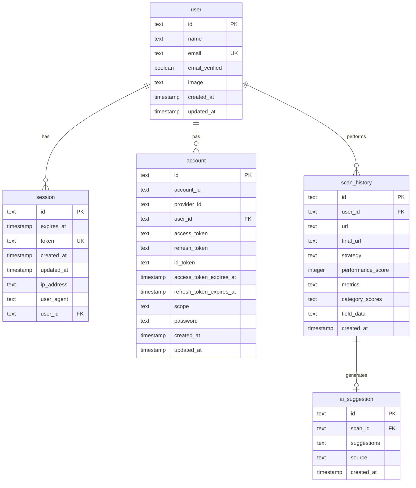

# Vantage - Database Schema

This document describes the database schema used by Vantage for storing user data, scan history, and AI suggestions.

---

## Overview

Vantage uses **Turso** (libSQL) as the database with **Drizzle ORM** for type-safe database operations. The database stores:

- User authentication data (via Better Auth)
- Scan history with Core Web Vitals metrics
- AI-generated optimization suggestions

---

## Entity Relationship Diagram



---

## Tables

### user

Stores user account information (managed by Better Auth).

| Column         | Type      | Constraints  | Description                    |
| -------------- | --------- | ------------ | ------------------------------ |
| id             | TEXT      | PRIMARY KEY  | Unique user identifier         |
| name           | TEXT      | NOT NULL     | User's display name            |
| email          | TEXT      | UNIQUE       | User's email address           |
| email_verified | INTEGER   | DEFAULT 0    | Whether email is verified      |
| image          | TEXT      |              | Profile image URL              |
| created_at     | TIMESTAMP | NOT NULL     | Account creation timestamp     |
| updated_at     | TIMESTAMP | NOT NULL     | Last update timestamp          |

### session

Stores active user sessions (managed by Better Auth).

| Column     | Type      | Constraints      | Description              |
| ---------- | --------- | ---------------- | ------------------------ |
| id         | TEXT      | PRIMARY KEY      | Session identifier       |
| expires_at | TIMESTAMP | NOT NULL         | Session expiration time  |
| token      | TEXT      | UNIQUE, NOT NULL | Session token            |
| ip_address | TEXT      |                  | Client IP address        |
| user_agent | TEXT      |                  | Client user agent        |
| user_id    | TEXT      | FOREIGN KEY      | Reference to user        |

### account

Stores OAuth account connections (managed by Better Auth).

| Column                   | Type      | Constraints  | Description                |
| ------------------------ | --------- | ------------ | -------------------------- |
| id                       | TEXT      | PRIMARY KEY  | Account identifier         |
| account_id               | TEXT      | NOT NULL     | External account ID        |
| provider_id              | TEXT      | NOT NULL     | OAuth provider (e.g., google) |
| user_id                  | TEXT      | FOREIGN KEY  | Reference to user          |
| access_token             | TEXT      |              | OAuth access token         |
| refresh_token            | TEXT      |              | OAuth refresh token        |
| access_token_expires_at  | TIMESTAMP |              | Token expiration           |

### scan_history

Stores URL analysis results from PageSpeed Insights API.

| Column            | Type      | Constraints      | Description                          |
| ----------------- | --------- | ---------------- | ------------------------------------ |
| id                | TEXT      | PRIMARY KEY      | Unique scan identifier (nanoid)      |
| user_id           | TEXT      | FOREIGN KEY      | Reference to user                    |
| url               | TEXT      | NOT NULL         | Original URL that was scanned        |
| final_url         | TEXT      | NOT NULL         | Final URL after redirects            |
| strategy          | TEXT      | NOT NULL         | "mobile" or "desktop"                |
| performance_score | INTEGER   | NOT NULL         | Overall performance score (0-100)    |
| metrics           | TEXT      | NOT NULL         | JSON string of CoreWebVitals         |
| category_scores   | TEXT      |                  | JSON string of CategoryScores        |
| field_data        | TEXT      |                  | JSON string of FieldData             |
| created_at        | TIMESTAMP | NOT NULL         | Scan timestamp                       |

**JSON Fields:**

- `metrics`: Contains LCP, CLS, FID, INP, TTFB, FCP values
- `category_scores`: Contains performance, accessibility, best-practices, SEO scores
- `field_data`: Contains Chrome UX Report data if available

### ai_suggestion

Stores AI-generated optimization recommendations.

| Column      | Type      | Constraints      | Description                          |
| ----------- | --------- | ---------------- | ------------------------------------ |
| id          | TEXT      | PRIMARY KEY      | Unique suggestion set identifier     |
| scan_id     | TEXT      | FOREIGN KEY      | Reference to scan_history            |
| suggestions | TEXT      | NOT NULL         | JSON array of AISuggestion objects   |
| source      | TEXT      | NOT NULL         | "gemini" or "fallback"               |
| created_at  | TIMESTAMP | NOT NULL         | Suggestion generation timestamp      |

**Suggestion Structure:**

```typescript
interface AISuggestion {
    id: string;
    metric: string;
    title: string;
    priority: "high" | "medium" | "low";
    impact: string;
    currentValue: string;
    targetValue: string;
    suggestion: string;
    codeExample?: string;
}
```

---

## Migrations

### Running Migrations

To push schema changes to the database:

```bash
npx drizzle-kit push:sqlite
```

To generate migration files (for version control):

```bash
npx drizzle-kit generate:sqlite
```

### Configuration

Database configuration is in `drizzle.config.ts`:

```typescript
export default defineConfig({
    schema: "./src/db/schema.ts",
    out: "./drizzle",
    driver: "turso",
    dbCredentials: {
        url: process.env.TURSO_DATABASE_URL!,
        authToken: process.env.TURSO_AUTH_TOKEN,
    },
});
```

---

## Usage Examples

### Inserting a Scan

```typescript
import { db } from "@/db/client";
import { scanHistory } from "@/db/schema";
import { nanoid } from "nanoid";

await db.insert(scanHistory).values({
    id: nanoid(),
    userId: session.user.id,
    url: "https://example.com",
    finalUrl: "https://example.com",
    strategy: "mobile",
    performanceScore: 85,
    metrics: JSON.stringify(coreWebVitals),
    createdAt: new Date(),
});
```

### Querying User's Scans

```typescript
import { db } from "@/db/client";
import { scanHistory } from "@/db/schema";
import { eq, desc } from "drizzle-orm";

const scans = await db
    .select()
    .from(scanHistory)
    .where(eq(scanHistory.userId, userId))
    .orderBy(desc(scanHistory.createdAt))
    .limit(10);
```

### Getting Scan with Suggestions

```typescript
import { db } from "@/db/client";
import { scanHistory, aiSuggestion } from "@/db/schema";
import { eq } from "drizzle-orm";

const scan = await db
    .select()
    .from(scanHistory)
    .where(eq(scanHistory.id, scanId))
    .limit(1);

const suggestions = await db
    .select()
    .from(aiSuggestion)
    .where(eq(aiSuggestion.scanId, scanId))
    .limit(1);
```

---

## Environment Variables

Required environment variables for database connection:

```env
TURSO_DATABASE_URL=libsql://your-database.turso.io
TURSO_AUTH_TOKEN=your-auth-token
```

---

## Last Updated

2026-01-03
